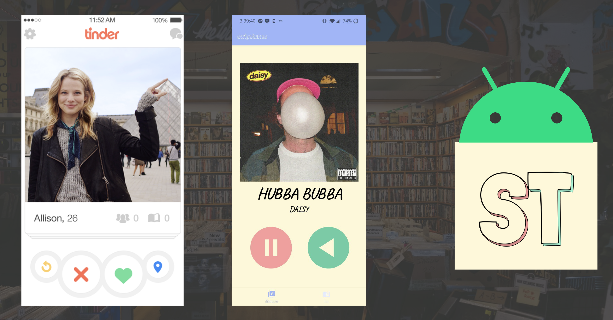
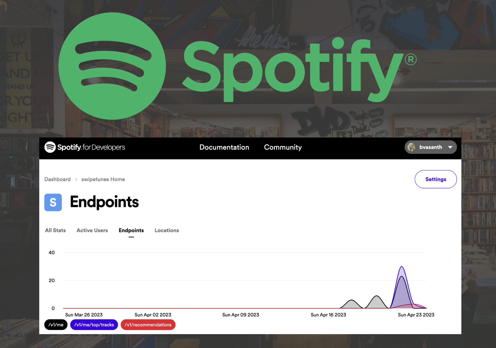
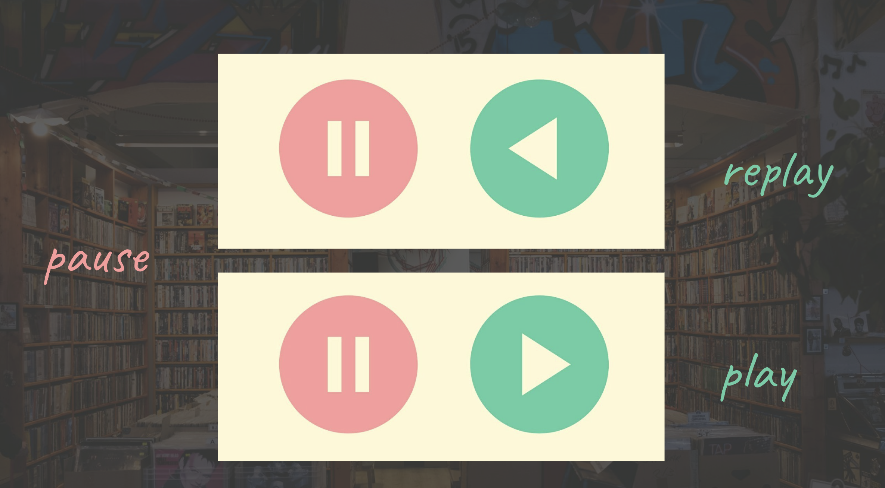
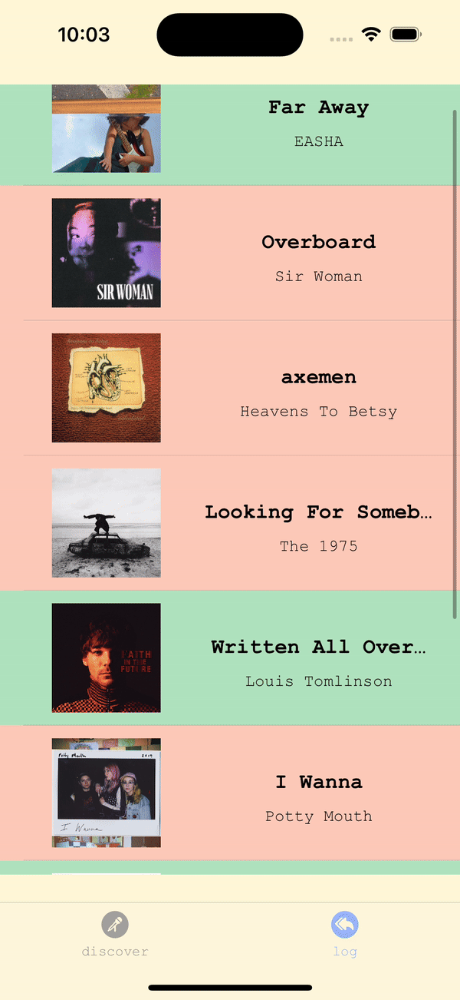
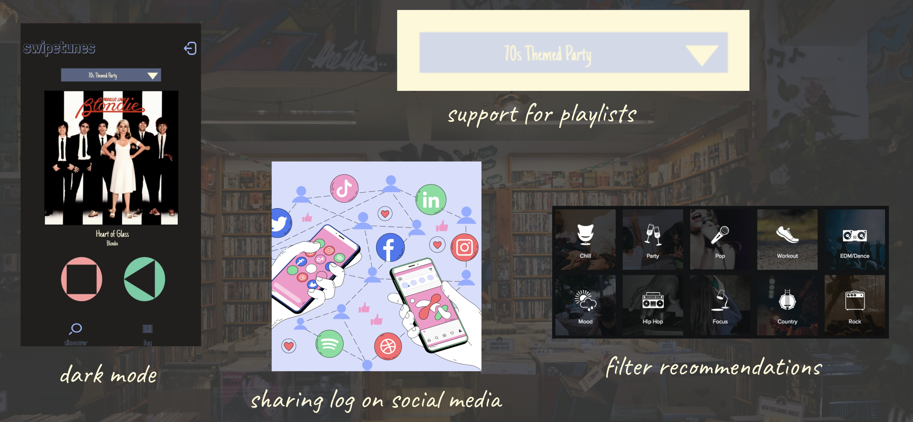
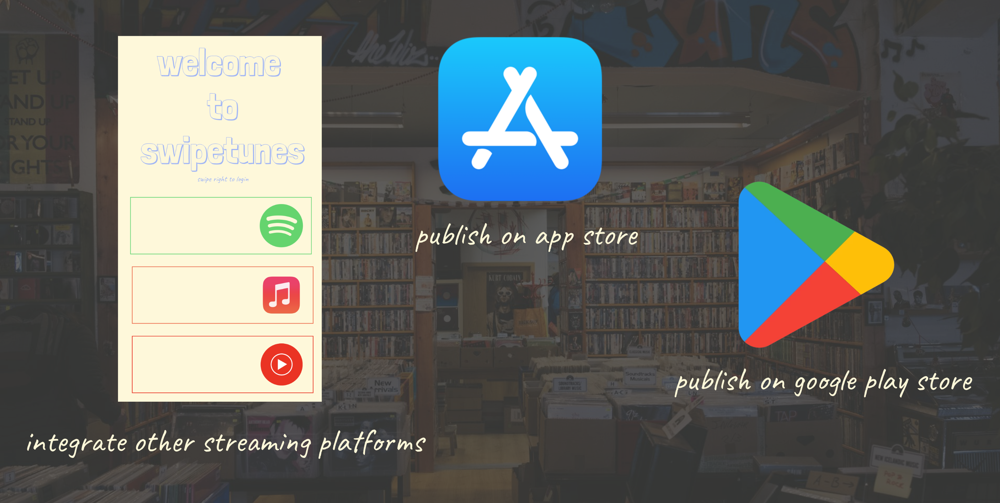
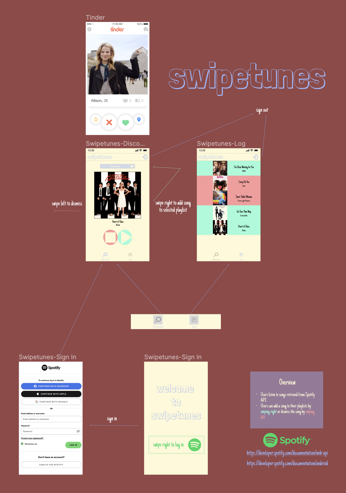

  

## Overview
Swipetunes is a dynamic music discovery app that lets you find your perfect match in songs. Mimicking the feel of modern dating apps, users can swipe their way to create the perfect playlist for any occasion.

  

## Background
- **Android Development Team**: Vasanth Banumurthy, Benita Abraham, Gabriel Castejon, and Victor Akolo
- **iOS Development Team**: Vasanth Banumurthy

- This project was part of [CodePath's](https://www.codepath.org/) [Android Development Pathway](https://www.codepath.org/courses/android-development).  

- We ended the program with a live demo/pitch of our app. Watch it [HERE](https://www.youtube.com/watch?v=1hdZvhzamnk&list=PLrT2tZ9JRrf7I6xjY-SY-93kpo_mdcHE2&index=13&t=55m2s). 

- The project is ongoing, as we hope to add new features and polish our recommendation algorithm. 

- **NOTE:** The codebase remains private. Feel free to reach out if you want to learn more about how we built this app!

## Implementation

Swipetunes is currently being built for [Android](https://developer.android.com/) using [Kotlin](https://kotlinlang.org/) and [iOS](https://developer.apple.com/) using [Swift](https://developer.apple.com/swift/).

Our app integrates Spotify's [API](https://developer.spotify.com/documentation/web-api) to allow users to sign in and get personalized reccomendations.

  

## Features

### OAuth 2.0
We use the industry-standard protocol for authorization. View the [documentation](https://developer.spotify.com/documentation/web-api/concepts/authorization) for more info. 

  

### Discover
Users can swipe right on what they like, and left on what they don’t and the song will be highlighted green or red accordingly. The recommendations adapt dynamically based on what the user swipes. Hence, our algorithm ensures that every session is unique and the content is endless.

  

### MediaPlayer
The app will play a 30 second preview of the song automatically and users can control their music playback using a pause and dynamic play button that doubles as a replay button .

  

### Log
Users can view their swipe history and even reswipe after a second listen. More functionality is coming soon!

  

### Coming Soon

  

  

## Base App Wireframe (Figma)

  

